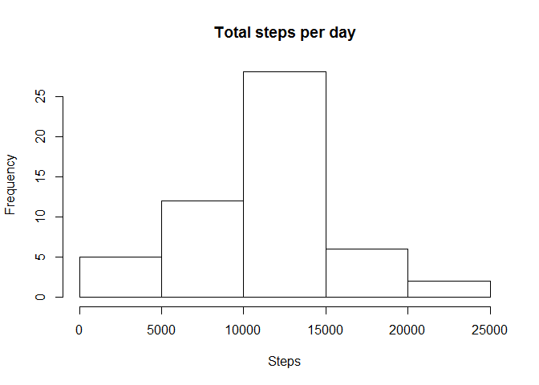

This markdown document demonstrates the steps necessary to complete
Project \#1 in the Coursera Reproducible Research Course

First we will load required packages

    library(knitr)
    library(dplyr)
    library(ggplot2)

Then we will load and look at a sample of the data

    data<-read.csv("activity.csv")
    head(data)

    ##   steps       date interval
    ## 1    NA 2012-10-01        0
    ## 2    NA 2012-10-01        5
    ## 3    NA 2012-10-01       10
    ## 4    NA 2012-10-01       15
    ## 5    NA 2012-10-01       20
    ## 6    NA 2012-10-01       25

Next we will remove the NA values from the steps column in the data

    clean_data <- data[ with (data, { !(is.na(steps)) } ), ]

Next lets take a look at the data to ensure NA values were removed
properly

    head(clean_data)

    ##     steps       date interval
    ## 289     0 2012-10-02        0
    ## 290     0 2012-10-02        5
    ## 291     0 2012-10-02       10
    ## 292     0 2012-10-02       15
    ## 293     0 2012-10-02       20
    ## 294     0 2012-10-02       25

**Now we can perform some analysis of the data**

*What is the Mean number of steps per day?*

Sum total steps per day and show sample

    daydata <- group_by(clean_data, date)
    totalsteps<- summarize(daydata, total = sum(steps))
    head(totalsteps)

    ## Source: local data frame [6 x 2]
    ## 
    ##         date total
    ##       (fctr) (int)
    ## 1 2012-10-02   126
    ## 2 2012-10-03 11352
    ## 3 2012-10-04 12116
    ## 4 2012-10-05 13294
    ## 5 2012-10-06 15420
    ## 6 2012-10-07 11015

Histogram of total steps per day

    hist(totalsteps$total, main="Total steps per day", 
         xlab="Steps")

Summary of Total Steps per day

    summary(totalsteps)

    ##          date        total      
    ##  2012-10-02: 1   Min.   :   41  
    ##  2012-10-03: 1   1st Qu.: 8841  
    ##  2012-10-04: 1   Median :10765  
    ##  2012-10-05: 1   Mean   :10766  
    ##  2012-10-06: 1   3rd Qu.:13294  
    ##  2012-10-07: 1   Max.   :21194  
    ##  (Other)   :47

*What is the average daily activity?*

Prepare data

    intervaldata <- aggregate(steps ~ interval, data, mean)

Make a time series plot

    plot(intervaldata$interval, intervaldata$steps, type='l', 
         main="Average steps for all days", xlab="Interval", 
         ylab="Average steps")

Find Maximum

    maxsteps <- which.max(intervaldata$steps)
    intervaldata[maxsteps, ]

    ##     interval    steps
    ## 104      835 206.1698

*Impute Missing Values*

Calcualte total missing

    sum(is.na(data))

    ## [1] 2304

Replace NA values with 5 minute interval average, show sample of
resulting data

    No_NA <- data
    for (i in 1:nrow(No_NA)) {
      if (is.na(No_NA$steps[i])) {
        interval_value <- No_NA$interval[i]
        steps_value <- intervaldata[
          intervaldata$interval == interval_value,]
        No_NA$steps[i] <- steps_value$steps
      }
    }

    head(No_NA)

    ##       steps       date interval
    ## 1 1.7169811 2012-10-01        0
    ## 2 0.3396226 2012-10-01        5
    ## 3 0.1320755 2012-10-01       10
    ## 4 0.1509434 2012-10-01       15
    ## 5 0.0754717 2012-10-01       20
    ## 6 2.0943396 2012-10-01       25

calculate total steps and show sample

    NO_NA_Steps<- aggregate(steps ~ date, No_NA, sum)
    head(NO_NA_Steps)

    ##         date    steps
    ## 1 2012-10-01 10766.19
    ## 2 2012-10-02   126.00
    ## 3 2012-10-03 11352.00
    ## 4 2012-10-04 12116.00
    ## 5 2012-10-05 13294.00
    ## 6 2012-10-06 15420.00

Make histogram

    hist(NO_NA_Steps$steps, main="Total steps per day", 
         xlab="Steps")

Show mean of imputed data

    mean(NO_NA_Steps$steps)

    ## [1] 10766.19

Show median of imputed data

    median(NO_NA_Steps$steps)

    ## [1] 10766.19

Show mean of data with NA removed

    mean(totalsteps$total)

    ## [1] 10766.19

Show median of data with NA removed

    median(totalsteps$total)

    ## [1] 10765

Median values are slightly different and mean values are exactly the
same

*Are there different patterns between weekends and week days?*

Prepare data by categorizing days

    No_NA['type_of_day'] <- weekdays(as.Date(No_NA$date))
    No_NA$type_of_day[No_NA$type_of_day  %in% c('Saturday','Sunday') ] <- "weekend"
    No_NA$type_of_day[No_NA$type_of_day != "weekend"] <- "weekday"

convert to factor and calculate average steps

    No_NA$type_of_day <- as.factor(No_NA$type_of_day)

    Steps_by_interval <- aggregate(steps ~ interval + type_of_day, No_NA, mean)

    head(Steps_by_interval)

    ##   interval type_of_day      steps
    ## 1        0     weekday 2.25115304
    ## 2        5     weekday 0.44528302
    ## 3       10     weekday 0.17316562
    ## 4       15     weekday 0.19790356
    ## 5       20     weekday 0.09895178
    ## 6       25     weekday 1.59035639

Plot data on weekdays vs weekends

    qplot(interval, steps, data = Steps_by_interval,geom=c("line"), xlab = "Interval",  ylab = "Steps", main = "") +
      facet_wrap(~ type_of_day, ncol = 1)

